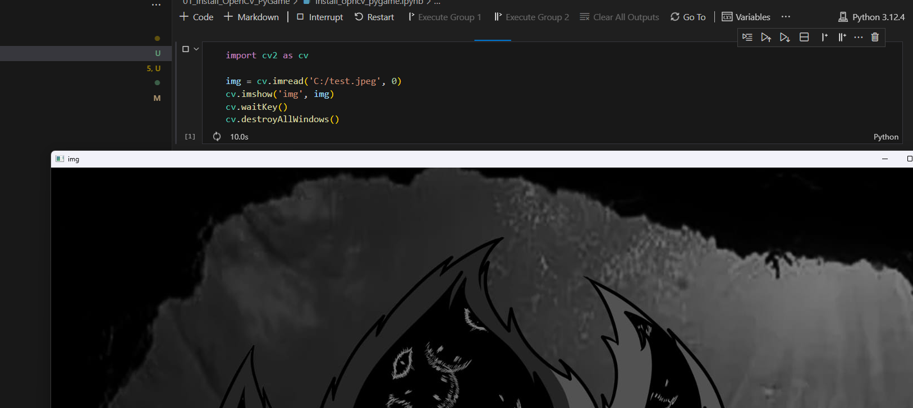
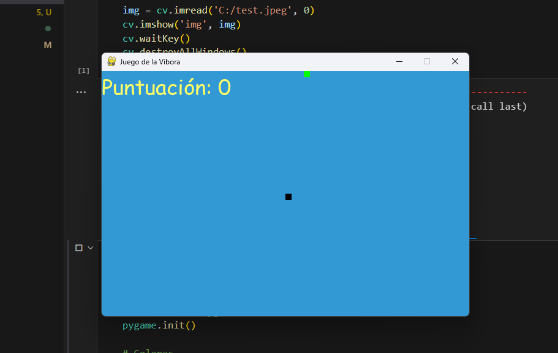

<em>DATE: JANUARY - JUNE 2024</em>

## **Install PyGame and opencv-contrib-python**

### Made In: Python

#### Activity number: 01

#### **DESCRIPTION:**

#### For this activity, only leed to prepare my system to run PyGame and OpenCV packages. I test this package runing a show image in gray scale and running a mini game generated with chat-gpt.

________________________________________________________
________________________________________________________

#### Student: José López Lara

#### Control Number: 19120194

* [x] Student Email: <l19120194@morelia.tecnm.mx>
* [x] Personal Email: <jose.lopez.lara.cto@gmail.com>
* [x] GitHub Profile: [JoseLopezLara](https://github.com/JoseLopezLara)
* [x] Linkedin Profile: [in/jose-lopez-lara/](https://www.linkedin.com/in/jose-lopez-lara/)

________________________________________________________
________________________________________________________

### **Testing OpenCV**

**Test:**

### **Testing PyGame**

**Test:**

