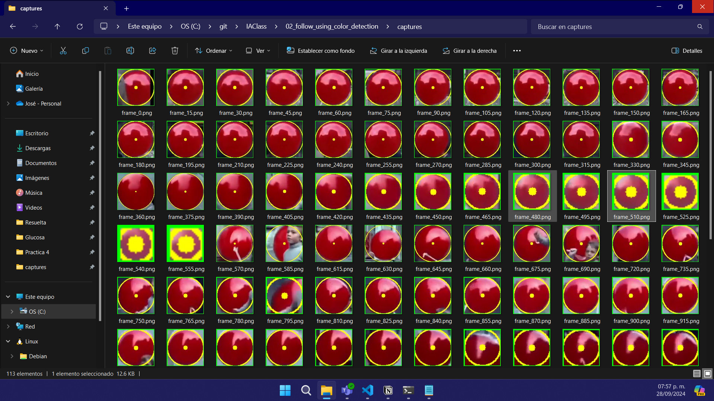

<p style="text-align: right;"><em>DATE: JANUARY - JUNE 2024</em></p>

## ** Follow an object using color Detection**

### Made In: Python

#### Activity number: 02

#### **DESCRIPTION:**

#### For this activity, we need to use open cv to create masks and use the color range with the inRange function, also, using a captured frame and the imwrite and resize functions, we can save captures every certain number of frames of the detected object

________________________________________________________
________________________________________________________

#### Student: José López Lara

#### Control Number: 19120194

* [x] Student Email: <l19120194@morelia.tecnm.mx>
* [x] Personal Email: <jose.lopez.lara.cto@gmail.com>
* [x] GitHub Profile: [JoseLopezLara](https://github.com/JoseLopezLara)
* [x] Linkedin Profile: [in/jose-lopez-lara/](https://www.linkedin.com/in/jose-lopez-lara/)

________________________________________________________
________________________________________________________

### **Code**

```python
import cv2
import numpy as np
import os

video_path = 'C:/git/IAClass/assets/color_detection/globo_rojo_corto.mp4'
output_directory = 'C:/git/IAClass/02_follow_using_color_detection/captures/'

# Iniciar la captura de video desde la cámara
cap = cv2.VideoCapture(video_path)

# Definir el rango de color que quieres rastrear en el espacio de color HSV
# Rango inferior del rojo
lower_red1 = (0, 100, 100)     
upper_red1 = (10, 255, 255)    
# Rango superior del rojo
lower_red2 = (170, 100, 100)   
upper_red2 = (180, 255, 255)  

# Contador de frames para nombrar las imágenes
frame_count = 0   

while True:
    # Capturar frame por frame
    ret, frame = cap.read()
    if not ret:
        break
    
    # Convertir el frame de BGR a HSV
    hsv = cv2.cvtColor(frame, cv2.COLOR_BGR2HSV)
    
    # Crear una máscara que detecte solo el color rojo
    # Crear las dos máscaras para el rango inferior y superior del rojo
    mask1 = cv2.inRange(hsv, lower_red1, upper_red1)
    mask2 = cv2.inRange(hsv, lower_red2, upper_red2)
    mask = cv2.bitwise_or(mask1, mask2)
    
    # Filtrar la máscara con operaciones morfológicas
    mask = cv2.erode(mask, None, iterations=2)
    mask = cv2.dilate(mask, None, iterations=2)
    
    
    # Encontrar contornos en la máscara
    contours, _ = cv2.findContours(mask, cv2.RETR_EXTERNAL, cv2.CHAIN_APPROX_SIMPLE)
    
    # Si se encuentra al menos un contorno, seguir el objeto
    if contours:
        # Tomar el contorno más grande
        largest_contour = max(contours, key=cv2.contourArea)
        
        # Encontrar el centro del contorno usando un círculo mínimo que lo rodee
        ((x, y), radius) = cv2.minEnclosingCircle(largest_contour)
        
        # Dibujar el círculo y el centro en el frame original si el radio es mayor que un umbral
        if radius > 10:
            cv2.circle(frame, (int(x), int(y)), int(radius), (0, 255, 255), 2)
            cv2.circle(frame, (int(x), int(y)), 5, (0, 255, 255), -1)
            
            # Calcular las coordenadas del rectángulo a partir del centro y el radio
            top_left = (int(x - radius), int(y - radius))  # Esquina superior izquierda
            bottom_right = (int(x + radius), int(y + radius))  # Esquina inferior derecha
            
            # Dibujar el rectángulo verde que rodea al segmento
            cv2.rectangle(frame, top_left, bottom_right, (0, 255, 0), 2)  # Color verde (0, 255, 0)
            
            #condicional para tomar efectuar recorte cada 15 frames:
            if frame_count % 15 == 0:
                # Recortar la región del rectángulo del frame original
                cropped_image = frame[top_left[1]:bottom_right[1], top_left[0]:bottom_right[0]]
            
                # Guardar la imagen recortada si no está vacía
                if cropped_image.size > 0:
                    # Redimensionar la imagen a 180x180 píxeles
                    resized_image = cv2.resize(cropped_image, (100, 100))
                    
                    filename = os.path.join(output_directory, f"frame_{frame_count}.png")
                    cv2.imwrite(filename, resized_image)
                    print(f"Imagen guardada: {filename}")
                    
            frame_count += 1        
                    
    # Mostrar el frame
    cv2.imshow('Frame', frame)
    cv2.imshow('Mask', mask)

    # Salir si se presiona la tecla 'q'
    if cv2.waitKey(1) & 0xFF == ord('q'):
        break

# Liberar la captura y cerrar todas las ventanas
cap.release()
cv2.destroyAllWindows()

```

### **Testing: Images saved**

**Test:**


