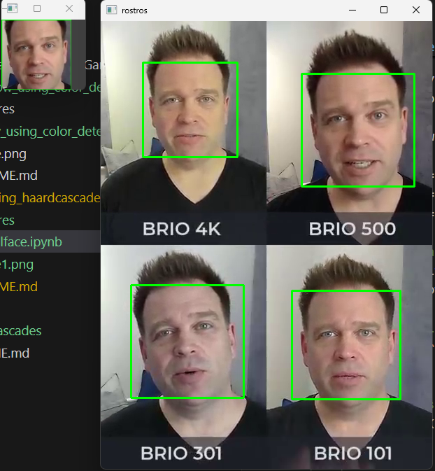

<p style="text-align: right;"><em>DATE: JANUARY - JUNE 2024</em></p>

## **Follow an object using haardcascades**

### Made In: Python

#### Activity number: 03

#### **DESCRIPTION:**

#### For this activity, we have to implement haardcascade to implement especifcly face detection haard cascade. Nexto, we will be implenting a very basic filter to face and finally, will implemnt face detection to create a data set of image face captures

________________________________________________________
________________________________________________________

#### Student: José López Lara

#### Control Number: 19120194

* [x] Student Email: <l19120194@morelia.tecnm.mx>
* [x] Personal Email: <jose.lopez.lara.cto@gmail.com>
* [x] GitHub Profile: [JoseLopezLara](https://github.com/JoseLopezLara)
* [x] Linkedin Profile: [in/jose-lopez-lara/](https://www.linkedin.com/in/jose-lopez-lara/)

________________________________________________________
________________________________________________________

### **Code to detect face and paint a fitter**

```python
import cv2 as cv 


video_path = 'C:/git/IAClass/assets/forntal_face_detection/test_frontal_face.mp4'
haardcascade_path = 'C:/git/IAClass/haardcascades/haarcascade_frontalface_alt.xml'
output_directory = 'C:/git/IAClass/03_testing_haardcascades_frontalcatface/captures/'

rostro = cv.CascadeClassifier(haardcascade_path)
cap = cv.VideoCapture(video_path)

if not cap.isOpened():
    print(f"Error: No se pudo abrir el video {video_path}")
    exit()
    
while True:
    ret, img = cap.read()
    
    # Verificar si se leyó correctamente el frame
    if not ret:
        print("Fin del video o error al leer el frame")
        break
    
    gris = cv.cvtColor(img, cv.COLOR_BGR2GRAY)
    rostros = rostro.detectMultiScale(gris, 1.3, 5)
    for(x,y,w,h) in rostros:
        res = int((w+h)/8)
        img = cv.rectangle(img, (x,y), (x+w, y+h), (234, 23,23), 2)
        img = cv.rectangle(img, (x,int(y+h/2)), (x+w, y+h), (0,255,0),5 )
        img = cv.circle(img, (x + int(w*0.3), y + int(h*0.4)) , 21, (0, 0, 0), 2 )
        img = cv.circle(img, (x + int(w*0.7), y + int(h*0.4)) , 21, (0, 0, 0), 2 )
        img = cv.circle(img, (x + int(w*0.3), y + int(h*0.4)) , 20, (255, 255, 255), -1 )
        img = cv.circle(img, (x + int(w*0.7), y + int(h*0.4)) , 20, (255, 255, 255), -1 )
        img = cv.circle(img, (x + int(w*0.3), y + int(h*0.4)) , 5, (0, 0, 255), -1 )
        img = cv.circle(img, (x + int(w*0.7), y + int(h*0.4)) , 5, (0, 0, 255), -1 )

    cv.imshow('img', img)
    if cv.waitKey(1)== ord('q'):
        break
    
cap.release
cv.destroyAllWindows()

```

### **Testing: Filter face**

**Test:**


### **Code to detect face and take a picture**

```python
import numpy as np
import cv2 as cv
import math 

video_path = 'C:/git/IAClass/assets/forntal_face_detection/test_frontal_face.mp4'
haardcascade_path = 'C:/git/IAClass/haardcascades/haarcascade_frontalface_alt.xml'
output_directory = 'C:/git/IAClass/03_testing_haardcascades_frontalcatface/captures/'

rostro = cv.CascadeClassifier(haardcascade_path)
cap = cv.VideoCapture(video_path)
i = 0  

if not cap.isOpened():
    print(f"Error: No se pudo abrir el video {video_path}")
    exit()

while True:
    ret, frame = cap.read()

    # Verificar si se leyó correctamente el frame
    if not ret:
        print("Fin del video o error al leer el frame")
        break

    gray = cv.cvtColor(frame, cv.COLOR_BGR2GRAY)
    rostros = rostro.detectMultiScale(gray, 1.3, 5)

    for (x, y, w, h) in rostros:
        frame = cv.rectangle(frame, (x, y), (x + w, y + h), (0, 255, 0), 2)
        frame2 = frame[y:y+h, x:x+w]
        frame3 = frame[y+30:y+h-30, x+30:x+w-30]  # Ajuste de índices
        frame2 = cv.resize(frame2, (100, 100), interpolation=cv.INTER_AREA)

        # Guardar la imagen capturada
        cv.imwrite(output_directory + str(i) + '.jpg', frame2)
        cv.imshow('rostror', frame2)

    # Mostrar el frame con los rostros detectados
    cv.imshow('rostros', frame)
    i = i + 1

    # Salir si se presiona la tecla 'ESC'
    k = cv.waitKey(1)
    if k == 27:
        break

cap.release()
cv.destroyAllWindows()

```

### **Testing: Detecting face and take capture**

**Test:**



