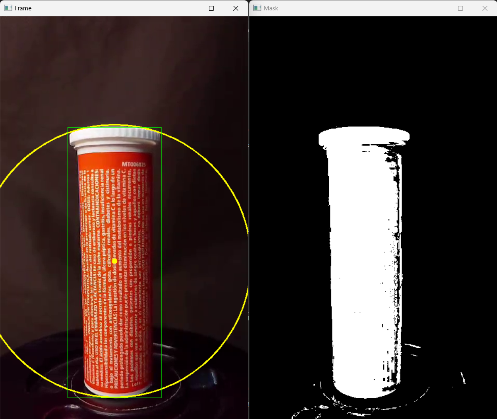
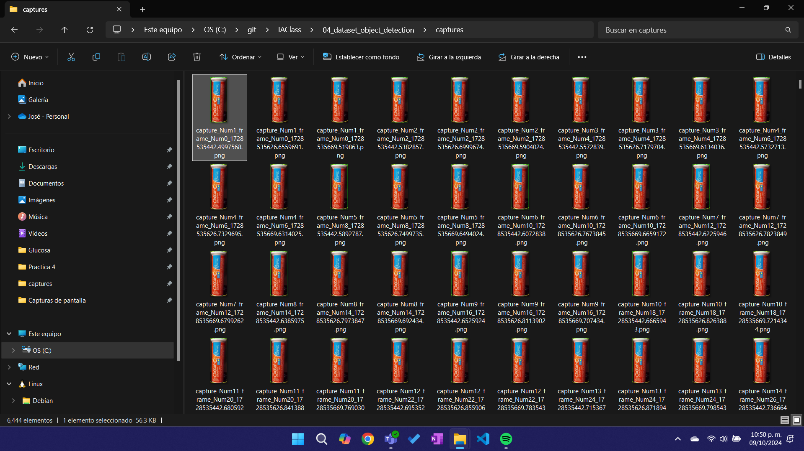

<p style="text-align: right;"><em>DATE: JANUARY - JUNE 2024</em></p>

## ** Follow an object using color Detection**

### Made In: Python

#### Activity number: 02

#### **DESCRIPTION:**

#### For this activity, we need to use open cv to create masks and use the color range with the inRange function, also, using a captured frame and the imwrite and resize functions, we can save captures every certain number of frames of the detected object. The main object is create a image data set to make a hardcascage

________________________________________________________
________________________________________________________

#### Student: José López Lara

#### Control Number: 19120194

* [x] Student Email: <l19120194@morelia.tecnm.mx>
* [x] Personal Email: <jose.lopez.lara.cto@gmail.com>
* [x] GitHub Profile: [JoseLopezLara](https://github.com/JoseLopezLara)
* [x] Linkedin Profile: [in/jose-lopez-lara/](https://www.linkedin.com/in/jose-lopez-lara/)

________________________________________________________
________________________________________________________

### **Code**

```python
import cv2
import os
import time


video_path = 'C:/git/IAClass/assets/color_detection/vinamine_c_480.mp4'
output_directory = 'C:/git/IAClass/04_dataset_object_detection/captures/'

# Init video capture
cap = cv2.VideoCapture(video_path)
frame_count = 0 
capture_count = 0

# Rangos de color HSV
lower_orange = (0, 100, 80)
upper_orange = (20, 255, 255)
lower_blue = (90, 90, 110)
upper_blue = (130, 255, 255)
lower_white = (0, 0, 80)
upper_white = (180, 55, 255)
lower_shadows = (0, 39, 110)
upper_shadows = (130, 255, 255)
lower_orange_dark = (160, 220, 40)
upper_orange_dark = (180, 255, 70)

while True:
    # Capturar frame y condición de parado
    ret, frame = cap.read()
    if not ret:
        break
    
    # Frame to hsv moden a create mask
    hsv = cv2.cvtColor(frame, cv2.COLOR_BGR2HSV)
    
    mask1 = cv2.inRange(hsv, lower_orange, upper_orange)
    mask2 = cv2.inRange(hsv, lower_blue, upper_blue)
    mask3 = cv2.inRange(hsv, lower_white, upper_white)
    mask4 = cv2.inRange(hsv, lower_shadows, upper_shadows)
    mask5 = cv2.inRange(hsv, lower_orange_dark, upper_orange_dark)
    mask_mix_1_2 = cv2.bitwise_or(mask1, mask2)
    mask_mix_1_2_3= cv2.bitwise_or(mask_mix_1_2, mask3)
    mask_mix_1_2_3_4= cv2.bitwise_or(mask_mix_1_2_3, mask4)
    mask_mix_1_2_3_4_5= cv2.bitwise_or(mask_mix_1_2_3_4, mask5)
    
    mask = mask_mix_1_2_3_4_5
    
    # Filtrar la máscara con operaciones morfológicas
    mask = cv2.erode(mask, None, iterations=0)
    mask = cv2.dilate(mask, None, iterations=0)
    
    # Encontrar contornos en la máscara
    contours, _ = cv2.findContours(mask, cv2.RETR_EXTERNAL, cv2.CHAIN_APPROX_SIMPLE)
    if contours:
        
        # Encontrar contorno mayor y obtener centro
        largest_contour = max(contours, key=cv2.contourArea)
        ((x, y), radius) = cv2.minEnclosingCircle(largest_contour)
        
        # Dibujar el círculo y el centro en el frame original si el radio es mayor que un umbral
        if radius > 10:
            cv2.circle(frame, (int(x), int(y)), int(radius), (0, 255, 255), 2)
            cv2.circle(frame, (int(x), int(y)), 5, (0, 255, 255), -1)
            
            # Calcular (Esq superior izquierda y Esquina inferior derecha) 
            # y dibujar rectangulo a partir del centro y el radio
            top_left = (int(x - 90), int(y - (radius-5)))
            bottom_right = (int(x + 90), int(y + (radius)))             
            cv2.rectangle(frame, top_left, bottom_right, (0, 255, 0), 1)
            
            # Tomar y guardar captura cada "X" frames a partir de la región del rectángulo
            if frame_count % 2 == 0:
                
                cropped_image = frame[top_left[1]:bottom_right[1], top_left[0]:bottom_right[0]]
                
                if cropped_image.size > 0:
                    
                    capture_count += 1
                    
                    # Calcular el nuevo tamaño manteniendo la proporción
                    target_width = 100
                    (h, w) = cropped_image.shape[:2]
                    aspect_ratio = w / h
                    target_height = int(target_width / aspect_ratio)
                    resized_image = cv2.resize(cropped_image, (target_width, target_height))
                    
                    filename = os.path.join(output_directory, f"capture_Num{capture_count}_frame_Num{frame_count}_{time.time()}.png")
                    cv2.imwrite(filename, resized_image)
                    print(f"Imagen guardada: {filename}")
                    
            frame_count += 1  
                  
                    
    # Mostrar el frame
    cv2.imshow('Frame', frame)
    cv2.imshow('Mask', mask)

    # Salir si se presiona la tecla 'q'
    if cv2.waitKey(1) & 0xFF == ord('q'):
        break

# Liberar la captura y cerrar todas las ventanas
cap.release()
cv2.destroyAllWindows()
```

### **Testing: Color detection**

**Test:**



### **Testing: Images saved**

**Test:**


