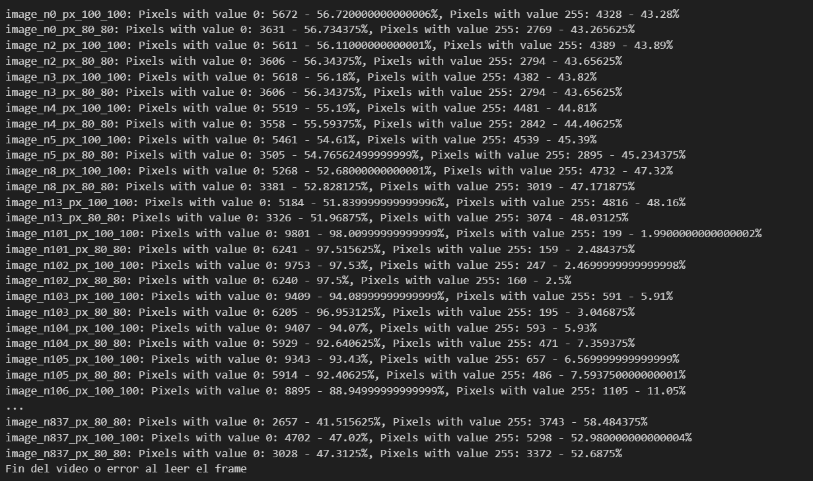

<p style="text-align: right;"><em>DATE: JANUARY - JUNE 2024</em></p>

## **Follow an object using haardcascades**

### Made In: Python

#### Activity number: 05

#### **DESCRIPTION:**

#### For this activity, we have to implement haardcascade to implement especifcly face detection haard cascade. Nexto, we will be implenting a very basic filter to face and finally, will implemnt face detection to create a data set of image face captures

________________________________________________________
________________________________________________________

#### Student: José López Lara

#### Control Number: 19120194

* [x] Student Email: <l19120194@morelia.tecnm.mx>
* [x] Personal Email: <jose.lopez.lara.cto@gmail.com>
* [x] GitHub Profile: [JoseLopezLara](https://github.com/JoseLopezLara)
* [x] Linkedin Profile: [in/jose-lopez-lara/](https://www.linkedin.com/in/jose-lopez-lara/)

________________________________________________________
________________________________________________________

### **Code to detect face and paint a fitter**

```python

```

**Test:**



