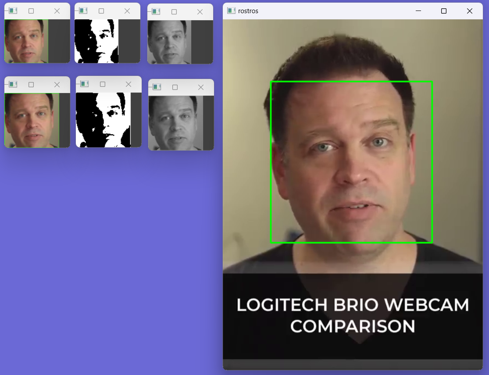

<p style="text-align: right;"><em>DATE: JANUARY - JUNE 2024</em></p>

## **Follow an face using haardcascades and recale in binary model to 100px and 80px**

### Made In: Python

#### Activity number: 05

#### **DESCRIPTION:**

#### For this activity, we have to implement haardcascade to implement especifcly face detection haard cascade. Nexto, we will be coampar the pixeles percent 255 and 0 from model binary between image recale to 100px x 100px and 80px x 80px.

________________________________________________________
________________________________________________________

#### Student: José López Lara

#### Control Number: 19120194

* [x] Student Email: <l19120194@morelia.tecnm.mx>
* [x] Personal Email: <jose.lopez.lara.cto@gmail.com>
* [x] GitHub Profile: [JoseLopezLara](https://github.com/JoseLopezLara)
* [x] Linkedin Profile: [in/jose-lopez-lara/](https://www.linkedin.com/in/jose-lopez-lara/)

________________________________________________________
________________________________________________________

### **Code to detect face and paint a fitter**

```python

import numpy as np
import cv2 as cv
import math 

video_path = 'C:/git/IAClass/assets/forntal_face_detection/test_frontal_face.mp4'
haardcascade_path = 'C:/git/IAClass/haardcascades/haarcascade_frontalface_alt.xml'
output_directory = 'C:/git/IAClass/05_find_proporcion_using_binary_puntual/captures/'

rostro = cv.CascadeClassifier(haardcascade_path)
cap = cv.VideoCapture(video_path)
i = 0  


# --------------------------------------------
# Functions:
def analyze_frame_pixels(frame):
    count_0 = 0
    count_255 = 0
    total_pixels = frame.shape[0] * frame.shape[1]
    for row in frame:
        for pixel in row:
            if pixel == 0:
                count_0 += 1
            elif pixel == 255:
                count_255 += 1
    percentage_0 = (count_0 / total_pixels) * 100
    percentage_255 = (count_255 / total_pixels) * 100
    return count_0, count_255, percentage_0, percentage_255

# --------------------------------------------

if not cap.isOpened():
    print(f"Error: No se pudo abrir el video {video_path}")
    exit()

while True:
    ret, frame = cap.read()

    # Verificar si se leyó correctamente el frame
    if not ret:
        print("Fin del video o error al leer el frame")
        break

    gray = cv.cvtColor(frame, cv.COLOR_BGR2GRAY)
    rostros = rostro.detectMultiScale(gray, 1.3, 5)
    

    for (x, y, w, h) in rostros:
        frame = cv.rectangle(frame, (x, y), (x + w, y + h), (0, 255, 0), 2)
        frame2 = frame[y:y+h, x:x+w]
        frame3 = frame[y+30:y+h-30, x+30:x+w-30]  # Ajuste de índices
        frame2_100_100 = cv.resize(frame2, (100, 100), interpolation=cv.INTER_AREA)
        frame2_80_80 = cv.resize(frame2, (80, 80), interpolation=cv.INTER_AREA)

        # Guardar la imagen capturada
        cv.imshow('rostror_frame2_100_100', frame2_100_100)
        cv.imshow('rostror_frame2_80_80', frame2_80_80)
        
        # Pasing to gray scale both image
        frame_face_recorted_gray_100_100 = cv.cvtColor(frame2_100_100, cv.COLOR_BGR2GRAY)
        frame_face_recorted_gray_80_80 = cv.cvtColor(frame2_80_80, cv.COLOR_BGR2GRAY)
        cv.imshow('rostro_gray_100_100', frame_face_recorted_gray_100_100)
        cv.imshow('rostro_gray_80_80', frame_face_recorted_gray_80_80)

        # Pass to banary sacale, save, show and caount pixels un 100_100pixels
        _, frame_face_binary_100_100 = cv.threshold(frame_face_recorted_gray_100_100, 127, 255, cv.THRESH_BINARY)
        cv.imwrite(output_directory + 'image_n' + str(i) + '_px_' + '100_100' + '.jpg', frame_face_binary_100_100)
        cv.imshow('rostro_binary_100_100', frame_face_binary_100_100)
        count_0, count_255, percentage_0, percentage_255 = analyze_frame_pixels(frame_face_binary_100_100)
        print(f"image_n{i}_px_100_100: Pixels with value 0: {count_0} - {percentage_0}%, Pixels with value 255: {count_255} - {percentage_255}%")

        # Pass to banary sacale, save, show and caount pixels un 80_80pixels
        _, frame_face_binary_80_80 = cv.threshold(frame_face_recorted_gray_80_80, 127, 255, cv.THRESH_BINARY)
        cv.imwrite(output_directory + 'image_n' + str(i) + '_px_' + '80_80' + '.jpg', frame_face_binary_80_80)
        cv.imshow('rostro_binary_80_80', frame_face_binary_80_80)        
        count_0, count_255, percentage_0, percentage_255 = analyze_frame_pixels(frame_face_binary_80_80)
        print(f"image_n{i}_px_80_80: Pixels with value 0: {count_0} - {percentage_0}%, Pixels with value 255: {count_255} - {percentage_255}%")

        

    # Mostrar el frame con los rostros detectados
    cv.imshow('rostros', frame)
    i = i + 1

    # Salir si se presiona la tecla 'ESC'
    k = cv.waitKey(1)
    if k == 27:
        break

cap.release()
cv.destroyAllWindows()

```

**Test: Multiple frames with diferentes filters**


**Test:Compare the percent between imaga rescale 100px x 100px and imaga rescale 80px x 80px**

