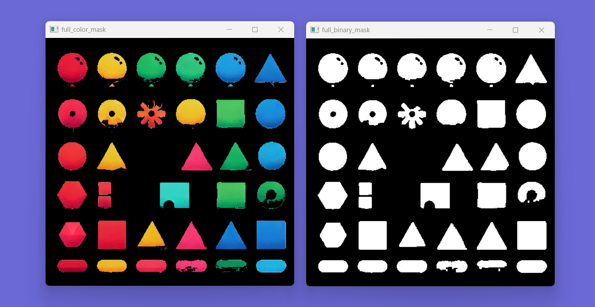
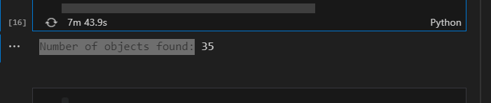
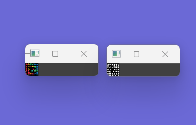
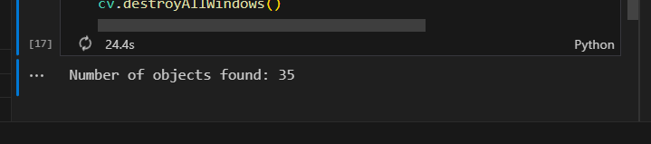

<p style="text-align: right;"><em>DATE: JANUARY - JUNE 2024</em></p>

## **Count Number Of Figures**

### Made In: Python

#### Activity number: 06

#### **DESCRIPTION:**

#### For this activity, we have to use color segmentation and DFS to detect the number of objects tha their are into image

________________________________________________________
________________________________________________________

#### Student: José López Lara

#### Control Number: 19120194

* [x] Student Email: <l19120194@morelia.tecnm.mx>
* [x] Personal Email: <jose.lopez.lara.cto@gmail.com>
* [x] GitHub Profile: [JoseLopezLara](https://github.com/JoseLopezLara)
* [x] Linkedin Profile: [in/jose-lopez-lara/](https://www.linkedin.com/in/jose-lopez-lara/)

________________________________________________________
________________________________________________________

### **Code to detect number of object using DFS and an umbral of number the pixel changed from 255 to 0**

```python


import cv2 as cv
# image path
image_path = 'C:/git/IAClass/06_count_number_of_figures/image_with_35_diferents_objects.jpg'

# ------------------------------------------------------------
# ----------------------- PROPERTIES -------------------------
# ------------------------------------------------------------

# convert to hsv
img = cv.imread(image_path, 1)
img = cv.resize(img, (450, 450))
img_hsv = cv.cvtColor(img, cv.COLOR_BGR2HSV)

# color hsv range
lower_red_a=(0, 80, 80  )
upper_red_a=(10, 255, 255)
lower_red_b=(170, 80,80)
upper_red_b=(180, 255, 255)
lower_yellow=(15, 80, 80  )
upper_yellow=(45, 255, 255)
lower_green=(40, 80, 80 )
upper_green=(80, 255, 255)
lower_blue=(85, 80, 80 )
upper_blue=(135, 255, 255)

# ------------------------------------------------------------
# ----------------------- FUNCTIONS -------------------------
# ------------------------------------------------------------

def islands_counter(binary_mask):

    rows = binary_mask.shape[0]
    columns = binary_mask.shape[1]
    count = 0
    umbral = 400

    # Recursive DFS to mark connected cells. 
    def dfs(binary_mask, i, j):
        # Verify limits and visited cell
        if i < 0 or i >= rows or j < 0 or j >= columns or binary_mask[i, j] == 0:
            return 0

        binary_mask[i, j] = 0
        nodes = 1
        
        nodes += dfs(binary_mask, i - 1, j)  # Up
        nodes += dfs(binary_mask, i + 1, j)  # Down
        nodes += dfs(binary_mask, i, j - 1)  # Left
        nodes += dfs(binary_mask, i, j + 1)  # Right

        return nodes

    for i in range(binary_mask.shape[0]):
        for j in range(binary_mask.shape[1]):
            if binary_mask[i, j] == 255:
                nodes_from_island = dfs(binary_mask, i, j)
                
                if nodes_from_island > umbral:
                    count += 1

    return count


# ------------------------------------------------------------

# Splitting main image into binary masks by color
mask_binary_red_a = cv.inRange(img_hsv, lower_red_a, upper_red_a)
mask_binary_red_b = cv.inRange(img_hsv, lower_red_b, upper_red_b)
mask_binary_red = mask_binary_red_a + mask_binary_red_b
mask_red = cv.bitwise_and(img, img, mask=mask_binary_red)

mask_binary_yellow = cv.inRange(img_hsv, lower_yellow, upper_yellow)
mask_yellow = cv.bitwise_and(img, img, mask=mask_binary_yellow)


mask_binary_green = cv.inRange(img_hsv, lower_green, upper_green)
mask_green = cv.bitwise_and(img, img, mask=mask_binary_green)


mask_binary_blue = cv.inRange(img_hsv, lower_blue, upper_blue)
mask_blue = cv.bitwise_and(img, img, mask=mask_binary_blue)

# Mix all binary mask
full_binary_mask = mask_binary_red + mask_binary_blue + mask_binary_green + mask_binary_yellow
full_color_mask = mask_red + mask_blue + mask_green + mask_yellow
full_binary_mask = cv.erode(full_binary_mask, None, iterations=1)
full_binary_mask = cv.dilate(full_binary_mask, None, iterations=1)


# ------------------------------------------------------------
# ----------------------- MIAN PROCESS -------------------------
# ------------------------------------------------------------

# Show masks
#cv.imshow('mask_red', mask_red)
#cv.imshow('mask_binary_red_a_b', mask_binary_red)
#
#cv.imshow('mask_yellow', mask_yellow)
#cv.imshow('mask_binary_yellow', mask_binary_yellow)
#
#cv.imshow('mask_green', mask_green)
#cv.imshow('mask_binary_green', mask_binary_green)
#
#cv.imshow('mask_blue', mask_blue)
#cv.imshow('mask_binary_blue', mask_binary_blue)

cv.imshow('full_color_mask', full_color_mask)
cv.imshow('full_binary_mask', full_binary_mask)


count = islands_counter(full_binary_mask)
print(f"Number of objects found: {count}")

# ------------------------------------------------------------

cv.waitKey(0)
cv.destroyAllWindows()
```

**Test: Full objects Masks**


**Test: Output**


### **Code to detect number of object using DFS and with out use umbral. However, I use a resize scale to 21px to 21px**

```python


import cv2 as cv
# image path
image_path = 'C:/git/IAClass/06_count_number_of_figures/image_with_35_diferents_objects.jpg'

# ------------------------------------------------------------
# ----------------------- PROPERTIES -------------------------
# ------------------------------------------------------------

# convert to hsvq
img = cv.imread(image_path, 1)
img = cv.resize(img, (21, 21))
img_hsv = cv.cvtColor(img, cv.COLOR_BGR2HSV)

# color hsv range
lower_red_a=(0, 80, 80  )
upper_red_a=(10, 255, 255)
lower_red_b=(170, 80,80)
upper_red_b=(180, 255, 255)
lower_yellow=(15, 80, 80  )
upper_yellow=(45, 255, 255)
lower_green=(40, 80, 80 )
upper_green=(80, 255, 255)
lower_blue=(85, 80, 80 )
upper_blue=(135, 255, 255)

# ------------------------------------------------------------
# ----------------------- FUNCTIONS -------------------------
# ------------------------------------------------------------

def islands_counter(binary_mask):

    rows = binary_mask.shape[0]
    columns = binary_mask.shape[1]
    count = 0
    umbral = 0

    # Recursive DFS to mark connected cells. 
    def dfs(binary_mask, i, j):
        # Verify limits and visited cell
        if i < 0 or i >= rows or j < 0 or j >= columns or binary_mask[i, j] == 0:
            return 0

        binary_mask[i, j] = 0
        nodes = 1
        
        nodes += dfs(binary_mask, i - 1, j)  # Up
        nodes += dfs(binary_mask, i + 1, j)  # Down
        nodes += dfs(binary_mask, i, j - 1)  # Left
        nodes += dfs(binary_mask, i, j + 1)  # Right

        return nodes

    for i in range(binary_mask.shape[0]):
        for j in range(binary_mask.shape[1]):
            if binary_mask[i, j] == 255:
                nodes_from_island = dfs(binary_mask, i, j)
                
                if nodes_from_island > umbral:
                    count += 1

    return count


# ------------------------------------------------------------

# Splitting main image into binary masks by color
mask_binary_red_a = cv.inRange(img_hsv, lower_red_a, upper_red_a)
mask_binary_red_b = cv.inRange(img_hsv, lower_red_b, upper_red_b)
mask_binary_red = mask_binary_red_a + mask_binary_red_b
mask_red = cv.bitwise_and(img, img, mask=mask_binary_red)

mask_binary_yellow = cv.inRange(img_hsv, lower_yellow, upper_yellow)
mask_yellow = cv.bitwise_and(img, img, mask=mask_binary_yellow)


mask_binary_green = cv.inRange(img_hsv, lower_green, upper_green)
mask_green = cv.bitwise_and(img, img, mask=mask_binary_green)


mask_binary_blue = cv.inRange(img_hsv, lower_blue, upper_blue)
mask_blue = cv.bitwise_and(img, img, mask=mask_binary_blue)

# Mix all binary mask
full_binary_mask = mask_binary_red + mask_binary_blue + mask_binary_green + mask_binary_yellow
full_color_mask = mask_red + mask_blue + mask_green + mask_yellow
#full_binary_mask = cv.erode(full_binary_mask, None, iterations=1)
#full_binary_mask = cv.dilate(full_binary_mask, None, iterations=1)

# ------------------------------------------------------------
# ----------------------- MIAN PROCESS -------------------------
# ------------------------------------------------------------

# Show masks
cv.imshow('full_color_mask', full_color_mask)
cv.imshow('full_binary_mask', full_binary_mask)


count = islands_counter(full_binary_mask)
print(f"Number of objects found: {count}")

# ------------------------------------------------------------

cv.waitKey(0)
cv.destroyAllWindows()
```

**Test: Full objects Masks**


**Test: Output**
