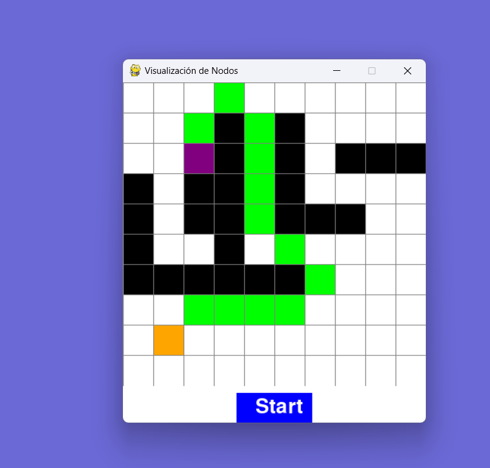
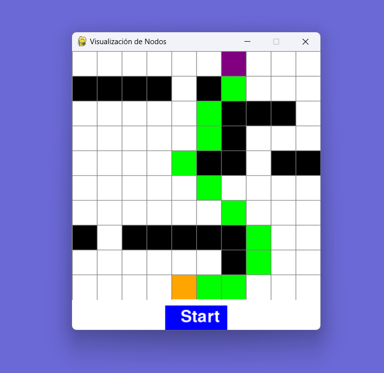

<p style="text-align: right;"><em>DATE: JANUARY - JUNE 2024</em></p>

# **PROJECT UNIT NUMBER ONE**

## **Shortest route to make**

### Made In: Python

#### Activity number: 07

#### **DESCRIPTION:**

#### For this activity we cant to find the most optimize route into maze using A* Algorithm. For better experience, we goint to use py game to hace dinamic mazes

________________________________________________________
________________________________________________________

#### Student: José López Lara

#### Control Number: 19120194

* [x] Student Email: <l19120194@morelia.tecnm.mx>
* [x] Personal Email: <jose.lopez.lara.cto@gmail.com>
* [x] GitHub Profile: [JoseLopezLara](https://github.com/JoseLopezLara)
* [x] Linkedin Profile: [in/jose-lopez-lara/](https://www.linkedin.com/in/jose-lopez-lara/)

________________________________________________________
________________________________________________________

### **Code to find shortest route**

```python
# ------------------------------------------------------------
# ------------------------------------------------------------
# -------- Version 2: Can move between diagonal cells --------
# ------------------------------------------------------------
# ------------------------------------------------------------

import pygame
import numpy as np
import heapq

# ------------------------------------------------------------
# ----------------------- PROPERTIES -------------------------
# ------------------------------------------------------------

# Configuraciones iniciales
ANCHO_VENTANA = 400
FILAS = 10
VENTANA = pygame.display.set_mode((ANCHO_VENTANA, ANCHO_VENTANA + 50))  # Espacio adicional para el boton
pygame.display.set_caption("Visualización de Nodos")

# Colores (RGB)
BLANCO = (255, 255, 255)
NEGRO = (0, 0, 0)
GRIS = (128, 128, 128)
VERDE = (0, 255, 0)
ROJO = (255, 0, 0)
NARANJA = (255, 165, 0)
PURPURA = (128, 0, 128)
AZUL = (0, 0, 255)

initial_position = {
    "x": None,
    "y": None,
}

final_position = {
    "x": None,
    "y": None,
}


# ------------------------------------------------------------
# ----------------------- CLASSES -------------------------
# ------------------------------------------------------------

class Nodo:
    def __init__(self, fila, col, ancho, total_filas):
        self.fila = fila
        self.col = col
        self.x = fila * ancho
        self.y = col * ancho
        self.color = BLANCO
        self.ancho = ancho
        self.total_filas = total_filas

    def get_pos(self):
        return self.fila, self.col

    def es_pared(self):
        return self.color == NEGRO

    def es_inicio(self):
        return self.color == NARANJA

    def es_fin(self):
        return self.color == PURPURA

    def restablecer(self):
        self.color = BLANCO

    def hacer_inicio(self):
        self.color = NARANJA

    def hacer_pared(self):
        self.color = NEGRO

    def hacer_fin(self):
        self.color = PURPURA
        
    def do_route(self):
        self.color = VERDE

    def dibujar(self, ventana):
        pygame.draw.rect(ventana, self.color, (self.x, self.y, self.ancho, self.ancho))

# ------------------------------------------------------------
# ----------------------- FUNCTIONS -------------------------
# ------------------------------------------------------------

def astar(matrix, initial_position, final_position):
    # ---------------- PROPERTIES ----------------
    rows = len(matrix)
    cols = len(matrix[0])
    movements = [(-1, 0), (1, 0), (0, -1), (0, 1),
                 (-1, -1), (-1, 1), (1, -1), (1, 1)]
    open_list = []
    closed_list = []

    # The heuristic remains the same
    def heuristic(a, b):
        return abs(a[0] - b[0]) + abs(a[1] - b[1])

    heapq.heappush(open_list, (0, initial_position))

    # Initialization of came_from and score dictionaries
    came_from = {}
    g_score = {pos: float('inf') for row in range(rows) for pos in [(row, col) for col in range(cols)]}
    g_score[initial_position] = 0
    f_score = {pos: float('inf') for row in range(rows) for pos in [(row, col) for col in range(cols)]}
    f_score[initial_position] = heuristic(initial_position, final_position)

    while open_list:
        current = heapq.heappop(open_list)[1]

        # If we have reached the final node, reconstruct the path
        if current == final_position:
            path = []
            while current in came_from:
                path.append(current)
                current = came_from[current]

            path.append(initial_position)
            return path[::-1]

        closed_list.append(current)

        # Check the neighbors
        for mov in movements:
            neighbor = (current[0] + mov[0], current[1] + mov[1])

            # Check matrix boundaries
            if 0 <= neighbor[0] < rows and 0 <= neighbor[1] < cols:
                # Check if it's not a wall ('P')
                if matrix[neighbor[0]][neighbor[1]] in ['C', 'I', 'F']:
                    if neighbor in closed_list:
                        continue

                    # Determine if the movement is diagonal or orizontal
                    if mov[0] != 0 and mov[1] != 0:
                        cost = 1.4
                    else:
                        cost = 1    

                    tentative_g_score = g_score[current] + cost

                    if tentative_g_score < g_score[neighbor]:
                        came_from[neighbor] = current
                        g_score[neighbor] = tentative_g_score
                        f_score[neighbor] = tentative_g_score + heuristic(neighbor, final_position)

                        # Add neighbor to open_list if not already there
                        if not any(neighbor == item[1] for item in open_list):
                            heapq.heappush(open_list, (f_score[neighbor], neighbor))

    return None

def crear_grid(filas, ancho):
    grid = []
    ancho_nodo = ancho // filas
    for i in range(filas):
        grid.append([])
        for j in range(filas):
            nodo = Nodo(i, j, ancho_nodo, filas)
            grid[i].append(nodo)
    return grid

def dibujar_grid(ventana, filas, ancho):
    ancho_nodo = ancho // filas
    for i in range(filas):
        pygame.draw.line(ventana, GRIS, (0, i * ancho_nodo), (ancho, i * ancho_nodo))
        for j in range(filas):
            pygame.draw.line(ventana, GRIS, (j * ancho_nodo, 0), (j * ancho_nodo, ancho))

def draw_start_button(ventana, ancho):
    fuente = pygame.font.SysFont(None, 40)
    texto = fuente.render("Start", True, BLANCO)
    boton_rect = pygame.Rect((ancho // 2) - 50, ancho + 10, 100, 40)
    pygame.draw.rect(ventana, AZUL, boton_rect)
    ventana.blit(texto, (boton_rect.x + 25, boton_rect.y + 5))
    return boton_rect

def dibujar(ventana, grid, filas, ancho):
    ventana.fill(BLANCO)
    for fila in grid:
        for nodo in fila:
            nodo.dibujar(ventana)

    dibujar_grid(ventana, filas, ancho)
    boton_rect = draw_start_button(ventana, ancho)

    pygame.display.update()
    return boton_rect

def obtener_click_pos(pos, filas, ancho):
    ancho_nodo = ancho // filas
    y, x = pos
    fila = y // ancho_nodo
    col = x // ancho_nodo
    return fila, col

def print_formated_grid(grid):
    for fila in grid:
        print([nodo.color for nodo in fila])
        
    current_grid = get_grid_formated(grid)
            
    print('---------------BY COLUMN-----------------')
    
    current_grid_rot90 = current_grid
    for column in current_grid_rot90:
        for cell in column:
            print(cell, end=" ") 
        print("")
        
    print('------------ LIKE A SCREEN --------------')
    current_grid_rot90 = np.transpose(current_grid)
    for column in current_grid_rot90:
        for cell in column:
            print(cell, end=" ") 
        print("")

def get_grid_formated(grid):
    
    current_grid = []
    for fila in grid:
        fila_colores = []
        for nodo in fila:
            if nodo.color == BLANCO:
                fila_colores.append('C')
            elif nodo.color == NEGRO:
                fila_colores.append('P')
            elif nodo.color == NARANJA:
                fila_colores.append('I')
            elif nodo.color == PURPURA:
                fila_colores.append('F')
        current_grid.append(fila_colores)
            
    return current_grid
    
def find_shortest_route(grid):
    if initial_position.get('x') != None and initial_position.get('y') != None and final_position.get('x') != None and final_position.get('y'):
        # --------------------- IMPORTANT ---------------------.
        # To calc initial pposition ad final position, I had to invert "x" and "y" coordinates to "y" and "x".
        # The reason is tha grid generate fist the columns and then, the rows 
        # --------------------- IMPORTANT ---------------------.
        initial_position_x_y = (initial_position.get('y'), initial_position.get('x'))
        final_position_x_y = (final_position.get('y'), final_position.get('x'))
        print("--------- Initial and final coordinates ---------")
        print(f'initial_position x:{initial_position_x_y[1]}')
        print(f'initial_position y:{initial_position_x_y[0]}')
        print(f'final_position x:{final_position_x_y[1]}')
        print(f'final_position y:{final_position_x_y[0]}')
        
        print('------------ CURRENT GRID (LIKEA NODES) --------------')
        current_formated_grid = get_grid_formated(grid)
        for column in current_formated_grid:
            for cell in column:
                print(cell, end=" ") 
            print("")
            
        
        route = astar(current_formated_grid, initial_position_x_y, final_position_x_y)

        if route:
            print("------------ ROUTE FOUND --------------")
            for step in route:
                print(step)
        else:
            print("------------ ROUTE DIDN'T FIND --------------")
            return

        # Review of the route
        grid_with_route = current_formated_grid
        
        # Meke matrix with route
        for step in route:
            fila, columna = step
            if grid_with_route[fila][columna] not in ['I', 'F']:
                grid_with_route[fila][columna] = '*'

        return route, grid_with_route
    return
    

def draw_find_shortest_route(grid, shortest_route):
    print('------------ PRINT SHORTEST ROUTE -------------')
    if shortest_route:
        print('Intitia position' +  str(initial_position))
        print('Final position' +  str(final_position))
        for step in shortest_route:
            node = grid[step[0]][step[1]]
            row, col = node.get_pos()
            
            if row == initial_position.get('y') and col == initial_position.get('x'):
                print('[Initial Position] row: ' + str(row) + 'col: ' + str(col))
                continue
                
            elif row == final_position.get('y') and col == final_position.get('x'):
                print('[Final Position] row: ' + str(row) + 'col: ' + str(col))
                continue
            
            print('[Rote Position] row: ' + str(row) + 'col: ' + str(col))
            node.do_route()
    else:
        print('No grid or no shortest_route in: draw_find_shortest_route')
        return
# ------------------------------------------------------------
# ----------------------- MAIN PROCESS -------------------------
# ------------------------------------------------------------

def main(ventana, filas, ancho):
    pygame.init()
    pygame.font.init()
    grid = crear_grid(filas, ancho)

    inicio = None
    fin = None

    corriendo = True

    while corriendo:
        boton_rect = dibujar(ventana, grid, filas, ancho)
        for event in pygame.event.get():
            if event.type == pygame.QUIT:
                corriendo = False

            if pygame.mouse.get_pressed()[0]:  # Click izquierdo
                pos = pygame.mouse.get_pos()
                if pos[1] > ancho:  # Verifica si el click es en el boton
                    if boton_rect.collidepoint(pos):
                        print("--------- Start button presed ---------")
                        shortest_route, grid_with_route = find_shortest_route(grid)
                        draw_find_shortest_route(grid, shortest_route)
                        
                else:
                    fila, col = obtener_click_pos(pos, filas, ancho)
                    nodo = grid[fila][col]
                    if not inicio and nodo != fin:
                        inicio = nodo
                        inicio.hacer_inicio()
                        
                        initial_position["x"] = col
                        initial_position["y"] = fila

                    elif not fin and nodo != inicio:
                        fin = nodo
                        fin.hacer_fin()
                        final_position["x"] = col
                        final_position["y"] = fila

                    elif nodo != fin and nodo != inicio:
                        nodo.hacer_pared()

            elif pygame.mouse.get_pressed()[2]:  # Click derecho
                pos = pygame.mouse.get_pos()
                if pos[1] <= ancho:  # Solo permite restablecer nodos dentro del grid
                    fila, col = obtener_click_pos(pos, filas, ancho)
                    nodo = grid[fila][col]
                    nodo.restablecer()
                    if nodo == inicio:
                        inicio = None
                    elif nodo == fin:
                        fin = None

    pygame.quit()

main(VENTANA, FILAS, ANCHO_VENTANA)
```

**Test: Test find shortest route #1**


**Test: Test find shortest route #2**

