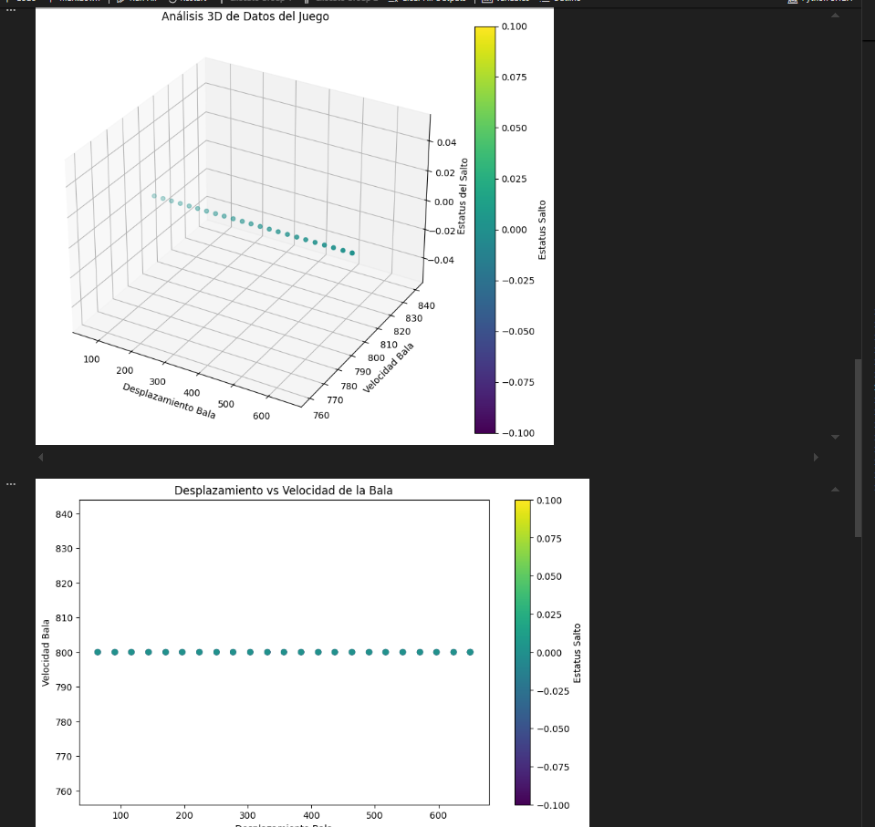
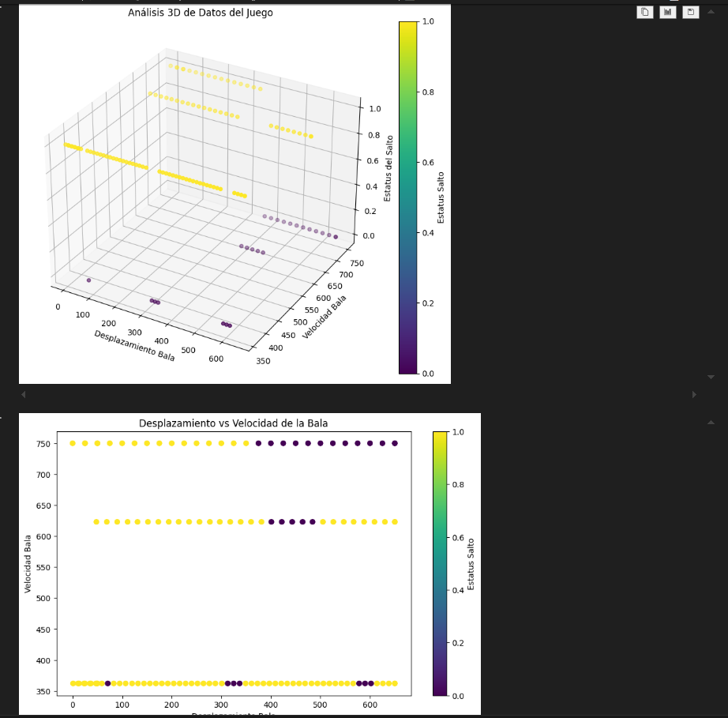
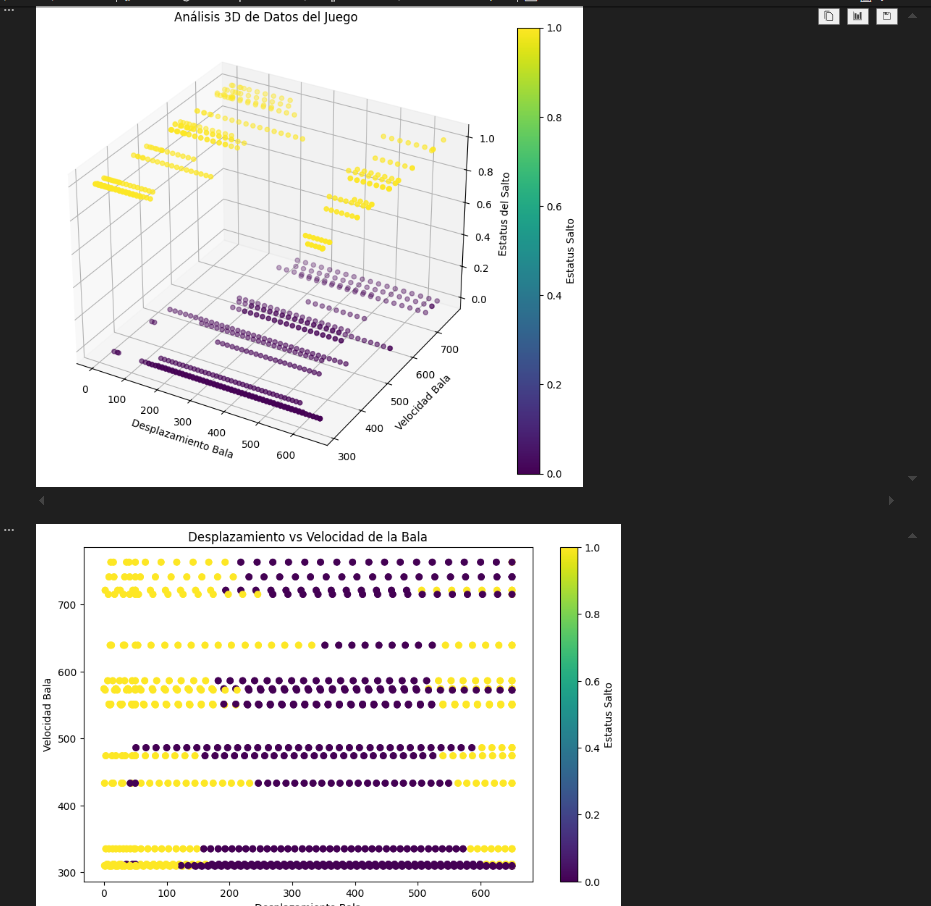
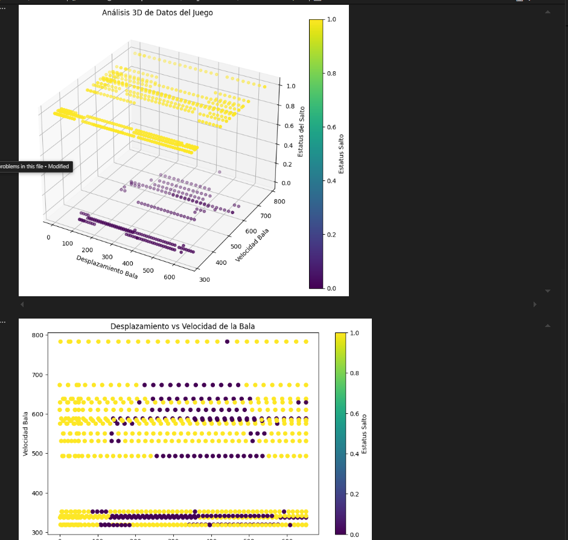
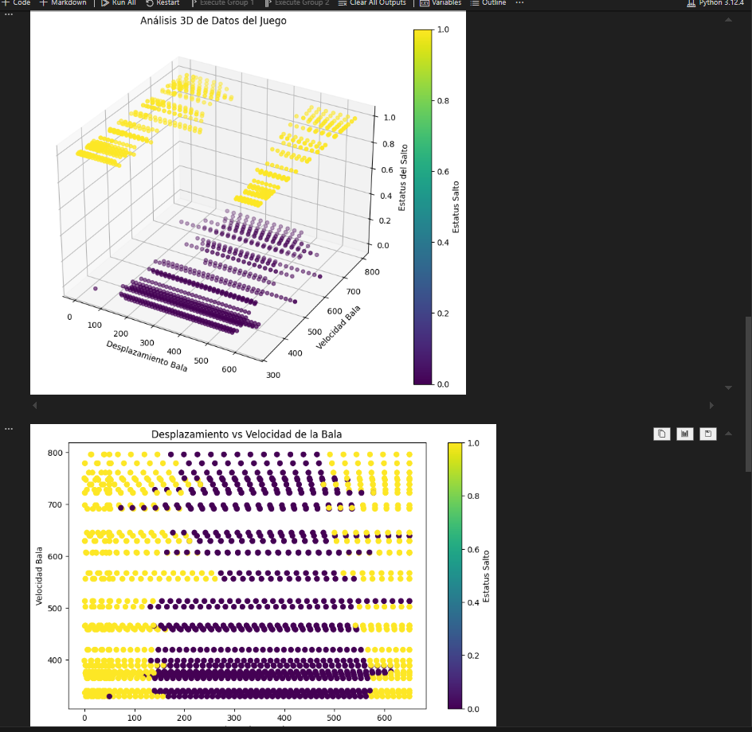

<p style="text-align: right;"><em>DATE: JANUARY - JUNE 2024</em></p>

# **PROJECT UNIT NUMBER ONE**

## **Shortest route to make**

### Made In: JavaScript

#### Activity number: 09

#### **DESCRIPTION:**

#### For this activity we have to test te phaser game privider by teacher. Then, we need to make 5 diferentes datasets and analyse them

________________________________________________________
________________________________________________________

#### Student: José López Lara

#### Control Number: 19120194

* [x] Student Email: <l19120194@morelia.tecnm.mx>
* [x] Personal Email: <jose.lopez.lara.cto@gmail.com>
* [x] GitHub Profile: [JoseLopezLara](https://github.com/JoseLopezLara)
* [x] Linkedin Profile: [in/jose-lopez-lara/](https://www.linkedin.com/in/jose-lopez-lara/)

________________________________________________________
________________________________________________________

### **STEP ONE: RUN PHASER GAME**

### **STEP TWO: MODIFY GAME TO PLAY AND GENERATE EXPORTED DATASETS IN CSV FORMAT**

#### I have played in 5 time in differents modes

1. Dataset1: Play and I lost iinmediatly
2. Dataset2: Inrregular game (Double jumps) and I  lost in 5 seconds.
3. Dataset3: Regular game and I lost in 25 seconds.
4. Dataset4: Inrregular game (Double jumps) and I lost in 25 seconds.
5. Dataset5: Regular game and I lost in 50 seconds.

**Test: Data sets generated**


### **STEP Three: Show dataset using a chart**

```python

import pandas as pd
import matplotlib.pyplot as plt
from mpl_toolkits.mplot3d import Axes3D
import ipywidgets as widgets
from ipywidgets import interact, interactive, fixed

# Load and read the CSV file

csv_file_name = 'DATASET1-ME-DEJO-PERDER-AL-INICIO'
# csv_file_name = 'DATASET2-JUEGO-IRREGULAR-5SEG'
# csv_file_name = 'DATASET3-JUEGO-REGULAR-25SEG'
# csv_file_name = 'DATASET4-JUEGO-IRREGULAR-SALTOS-DOBLES-25SEG'
# csv_file_name = 'DATASET5-JUGO-REGULAR-50SEG'

csv_path = 'C:/git/IAClass/09_dataset_from_phaser_gage/datasets/' + csv_file_name + '.csv'
df = pd.read_csv(csv_path)


# Verify if the columns don't contain text. If so, convert them to numeric or replace them with NaN
df['Desplazamiento Bala'] = pd.to_numeric(df['Desplazamiento Bala'], errors='coerce')
df['Velocidad Bala'] = pd.to_numeric(df['Velocidad Bala'], errors='coerce')
df['Estatus Salto'] = pd.to_numeric(df['Estatus Salto'], errors='coerce')


# Replace negative values with his absolute value. Before this, we delete NaN values
df = df.dropna()
df['Desplazamiento Bala'] = df['Desplazamiento Bala'].abs()
df['Velocidad Bala'] = df['Velocidad Bala'].abs()

# Stadistics of the data
print("\n------------ DATA EXAMPLE ------------")
print(df.head())
print("\n------------ TYPES OF PARAMS ------------")
print(df.dtypes)
print("\n------------ STATISTICS ------------")
print(df.describe())
print("\n------------ CORRELATIONS ------------")
print(df.corr())

# Create 3d chart and and 3d grid. Then, graph the data, additional labels and finally a colorbar
fig = plt.figure(figsize=(10, 8))
ax = fig.add_subplot(111, projection='3d')
scatter = ax.scatter(df['Desplazamiento Bala'], 
                     df['Velocidad Bala'], 
                     df['Estatus Salto'],
                     c=df['Estatus Salto'], 
                     cmap='viridis')

ax.set_xlabel('Desplazamiento Bala')
ax.set_ylabel('Velocidad Bala')
ax.set_zlabel('Estatus del Salto')
ax.set_title('Análisis 3D de Datos del Juego')

plt.colorbar(scatter, label='Estatus Salto')
plt.show()

# 2D grafic scatter.
plt.figure(figsize=(10, 6))
plt.scatter(df['Desplazamiento Bala'], df['Velocidad Bala'], c=df['Estatus Salto'], cmap='viridis')
plt.scatter(df['Desplazamiento Bala'], df['Velocidad Bala'], c=df['Estatus Salto'], cmap='viridis')
plt.xlabel('Desplazamiento Bala')
plt.ylabel('Velocidad Bala')
plt.title('Desplazamiento vs Velocidad de la Bala')
plt.colorbar(label='Estatus Salto')
plt.show()


##------------------------- INTERACTIVE -------------------------------
def plot_3d(elev, azim):
    fig = plt.figure(figsize=(10, 8))
    ax = fig.add_subplot(111, projection='3d')
    scatter = ax.scatter(df['Desplazamiento Bala'], 
                         df['Velocidad Bala'], 
                         df['Estatus Salto'],
                         c=df['Estatus Salto'], 
                         cmap='viridis')
    
    ax.set_xlabel('Desplazamiento Bala')
    ax.set_ylabel('Velocidad Bala')
    ax.set_zlabel('Estatus del Salto')
    ax.set_title('Análisis 3D de Datos del Juego')
    
    ax.view_init(elev=elev, azim=azim)
    plt.colorbar(scatter, label='Estatus Salto')
    plt.show()
    
# Crear controles interactivos
interactive_plot = interactive(plot_3d, 
                               elev=(-90, 90, 5), 
                               azim=(-180, 180, 5))
display(interactive_plot)

```

**Test: Dataset1: Play and I lost inmediatly**
I saw a line of data where all values are 0.


**Test: Dataset2: Inrregular game (Double jumps) and I  lost in 5 seconds.**
By the reaso that, I only hace 5 seconds of data set getter. And the game is irregular. I can saw the data division but I need mor secods to get better chart.


**Test: Dataset3: Regular game and I lost in 25 seconds.**
A regular game with 25 secons let me show the the diference when the chactere jump or does't jump 


**Test :Dataset4: Inrregular game (Double jumps) and I lost in 25 seconds.**
In a inrregular data set with 25 seconds. A log time have character jumping while the ball doesn't is near of me.


**Test: Dataset4: Inrregular game (Double jumps) and I lost in 25 seconds.**
The main diference between a data set with 25 second and 50 seconds is that I have a better clean grafict with lees empty spaces. Is more easy to see a accidental double jump.
