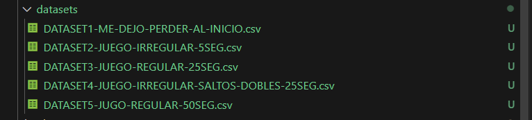

<em>DATE: JANUARY - JUNE 2024</em>

# **PROJECT UNIT NUMBER ONE**

## **Shortest route to make**

### Made In: JavaScript

#### Activity number: 09

#### **DESCRIPTION:**

#### For this activity we have to test te phaser game privider by teacher. Then, we need to make 5 diferentes datasets and analyse them.

________________________________________________________
________________________________________________________

#### Student: José López Lara

#### Control Number: 19120194

* [x] Student Email: <l19120194@morelia.tecnm.mx>
* [x] Personal Email: <jose.lopez.lara.cto@gmail.com>
* [x] GitHub Profile: [JoseLopezLara](https://github.com/JoseLopezLara)
* [x] Linkedin Profile: [in/jose-lopez-lara/](https://www.linkedin.com/in/jose-lopez-lara/)

________________________________________________________
________________________________________________________

### **NO CODE CREATED**

**Test: Test **

**Test: Test find shortest route #2**

