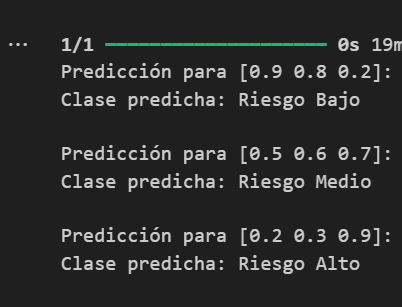

<p style="text-align: right;"><em>DATE: JANUARY - JUNE 2024</em></p>

## ** Exam Unit 4**

### Made In: Python

#### Activity number: 17

#### **DESCRIPTION:**

#### Clasificación de Clientes según su Perfil Financiero

________________________________________________________
________________________________________________________

#### Student: José López Lara

#### Control Number: 19120194

* [x] Student Email: <l19120194@morelia.tecnm.mx>
* [x] Personal Email: <jose.lopez.lara.cto@gmail.com>
* [x] GitHub Profile: [JoseLopezLara](https://github.com/JoseLopezLara)
* [x] Linkedin Profile: [in/jose-lopez-lara/](https://www.linkedin.com/in/jose-lopez-lara/)

________________________________________________________
________________________________________________________

### **Code**

```python


```

### Implementar una red neuronal multicapa para clasificar los clientes según su riesgo

### Encontrar los valores óptimos para los pesos `w1`, `w2` 'wn' y el sesgo `b` mediante entrenamiento

Test para evaluar modelos



### Graficar la frontera de decisión que separa los clientes


### ¿Son los datos linealmente separables?

Estos son lo que se pueden separar a travez de una linea

### ¿Qué ajustes podrían hacer al modelo para mejorar la clasificación?

Debemos de estar probando las diferentes cantididades de nueronas y las funciones para mejorar y optener los pesos adecuados.

### Describir cada una de las partes del modelo implementando

1. STEP 1: Generate artificial data
2. STEP 2: Mix random data when the origin balannced data
3. STEP 3: Dataset train and test split
4. STEP 4: Create neulal model with relu
5. STEP 5: Compile and train model
6. STEP 6: Evaluar el modelo en el conjunto de prueba


