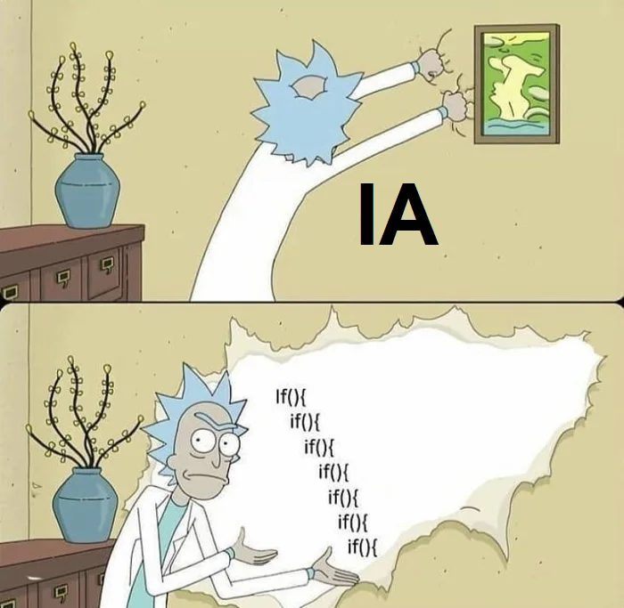

<em>DATE: Agust - December 2024</em>

# **Artificial Intelligence**

## Teacher: Dr. Alcaraz Chavez Jesus Eduardo

This repository contains assignments and projects from the Logic and Functional Programming course at the Instituto Tecnológico de Morelia. It focuses on mastering algorithmic thinking using Lisp and Prolog languages. Explore code implementations, exercises, and solutions of logical and functional programming paradigms.

_______________________________________________________
_______________________________________________________

### Student: López Lara José

#### Control Number: 19120194

* [x] Student Email: <l19120194@morelia.tecnm.mx>
* [x] Personal Email: <jose.lopez.lara.cto@gmail.com>
* [x] GitHub Profile: [JoseLopezLara](https://github.com/JoseLopezLara)
* [x] Linkedin Profile: [in/jose-lopez-lara/](https://www.linkedin.com/in/jose-lopez-lara/) 

_______________________________________________________
_______________________________________________________

_______________________________________________________
_______________________________________________________

### **LINK AL VIADEO DE LA UNIDAD 4**

**Link:** https://youtu.be/ZFjb7h9lqQE

**Reporte:** ["Clic para ir al markdown"](15_projectU4_reforma_judical_org_autonomos/README.md)

_______________________________________________________
_______________________________________________________

### Actividades realizadas

01. [Activity 01: Install and test: opencv-contrib-python and pygame](01_Install_OpenCV_PyGame/README.md)
02. [Activity 02: Follow an object using a color range](02_follow_using_color_detection/README.md)
03. [Activity 03: Face detection using haardcascades](03_testing_haardcascades_frontalcatface/README.md)
04. [Activity 04: Dataset object detection](04_dataset_object_detection/README.md)
05. [Activity 05: Find percent from rescale binary mask](05_find_proporcion_using_binary_puntual/README.md)
06. [Activity 06: Found number of figures using DFS and color detection](06_count_number_of_figures/README.md)
07. [**---> Proyect Unit N1:** Find the shortest route to maze using A* Algorithm (PyGame)](07_projectU1_shortest_route_to_maze/README.md)
08. [Activity 08: Jump the ball dataset](08_jump_the_ball_data_set/README.md)
09. [Activity 09: Dataset from Phaser game](09_dataset_from_phaser_gage/README.md)
10. [Activity 10: Graph decision tree](10_graph_desition_tree/README.md)
11. [Activity 11: Perceptron implementation](11_perceptron/README.md)
12. [**---> Proyect Unit N2:** Jump the ball with PyGames](12_projectU2_jump_the_ball_pygames/README.md)
13. [Activity 13: Convolutional filters](13_convolutive_filters/README.md)
14. [Activity 14: Run sports CNN](14_run_deports_cnn/README.md)
15. [**---> Proyect Unit N4:** LLM for "Org. Autonomos y L. Reforma Judicial"](15_projectU4_reforma_judical_org_autonomos/README.md)
16. [**---> Proyect Unit N3:** CNN for car classification](16_projectU3_cnn_cars/README.md)
17. [Activity 17: Exam Unit 4](17_EXAMEN_U4/README.md)
